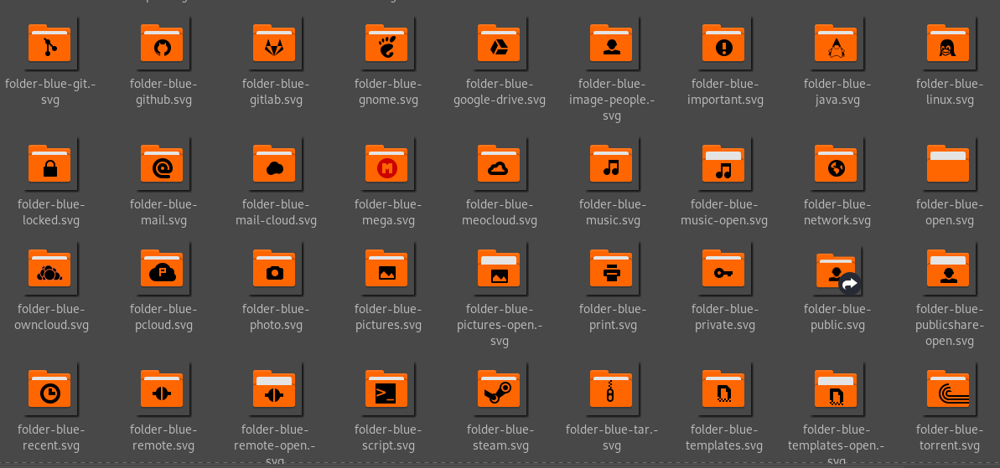

# Papirus Mer Icon Theme
Papirus Icon Theme Mercode Edition

## Installing

1. Download or clone this repository to any location

`git clone https://github.com/mercode-org/papirus-mer-icon-theme`

2. Go to the downloaded/cloned directory

`cd papirus-mer-icon-theme`

3. Run the executable

`./install.sh`

> If the executable doesn't work, make sure to give the necessary permissions with chmod.

`chmod 755 install.sh`

4. Done!

Enjoy!